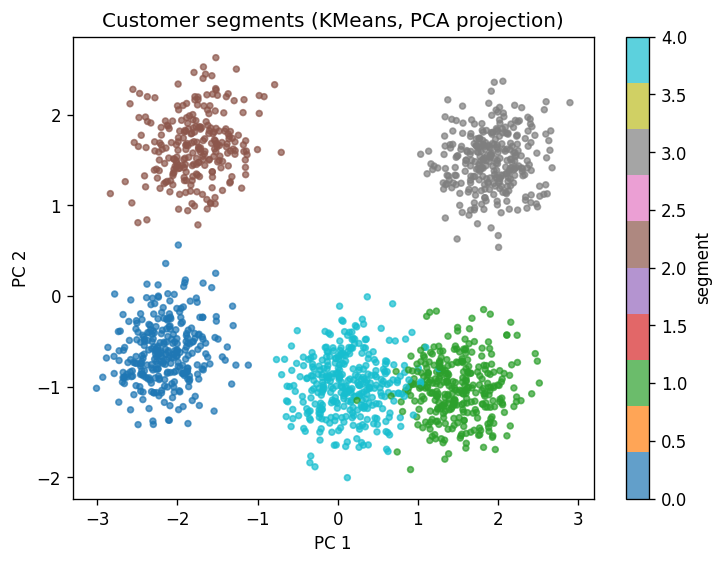
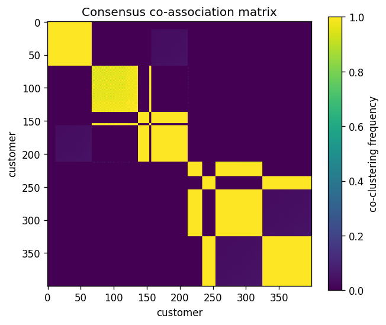
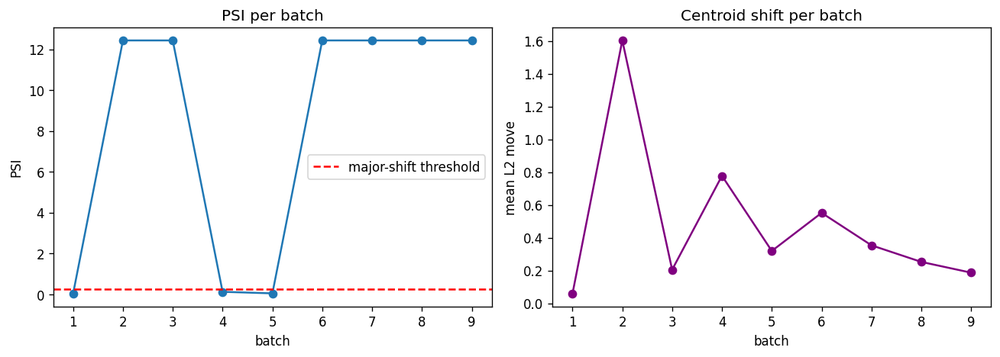

# Portfolio Summary

A notebook-first lab for **applied unsupervised learning**. The notebooks tell
the modelling story; a typed, tested Python package (`src/unsup_lab`) keeps that
story reproducible, and a thin CLI/API layer shows the same models can be
operationalised.

The emphasis throughout is on **modelling judgement** rather than algorithm
trivia: framing a problem without labels, choosing methods deliberately,
validating structure with internal metrics and stability analysis, and being
explicit about what unsupervised results can and cannot support.

## What it covers

| Area | Methods | Reusable module |
| --- | --- | --- |
| Customer segmentation | KMeans, GMM, Agglomerative, DBSCAN | `data`, `evaluation`, `reporting` |
| Dimensionality reduction | PCA, Kernel PCA, Isomap, LLE | `preprocessing`, `plotting` |
| Anomaly detection | Isolation Forest, LOF, robust covariance, PCA error | `service`, `data` |
| Topic modelling | TF-IDF, NMF, LSA, coherence & diversity | `nlp` |
| Recommender embeddings | TruncatedSVD / NMF matrix factorisation | `recommenders` |
| Model selection & stability | bootstrap stability, AMI, scaling/outlier sensitivity | `stability` |
| Consensus clustering | co-association ensemble | `consensus` |
| Streaming & drift | mini-batch KMeans, PSI drift monitoring | `streaming` |

## Engineering practices

- Typed, documented, input-validated functions with **92 unit tests**.
- Quality gate of **ruff + mypy + pytest** plus a notebook smoke-execution,
  wired into GitHub Actions CI.
- Deterministic synthetic data generators (fixed seeds) so every notebook is
  reproducible without private data.
- A production layer: `unsup-lab` CLI, model artifacts with metadata, JSON
  reports, a FastAPI scoring service, and a Dockerfile.

## What it deliberately avoids

- Treating unsupervised clusters or anomaly scores as ground truth.
- Heavy deep-learning dependencies; everything runs on NumPy, pandas, scipy,
  scikit-learn and matplotlib.
- Dependence on external APIs or private datasets.

## Selected figures

Regenerate with `python scripts/export_figures.py`.

*Customer segments (KMeans) in a PCA projection.*

*Co-association matrix from consensus clustering; block structure is the
evidence that the segments survive resampling.*

*Streaming drift monitoring: PSI and centroid shift spike when an injected
regime change arrives.*

## Further reading

- [`notebook_briefs.md`](notebook_briefs.md) - one-page brief per notebook.
- [`interview_talking_points.md`](interview_talking_points.md) - discussion prompts.
- [`cv_bullets.md`](cv_bullets.md) - CV bullet points.
- [`../ROADMAP.md`](../ROADMAP.md) - the wider roadmap and progress.
