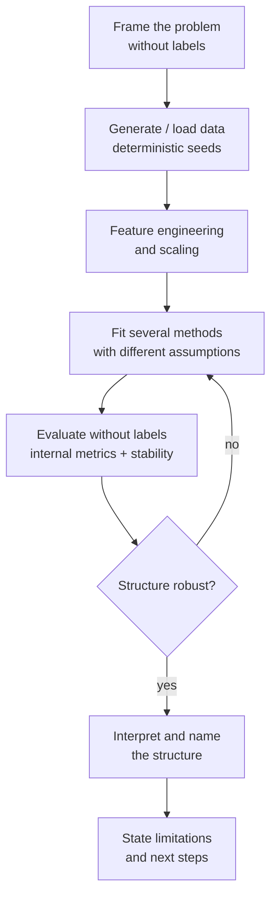
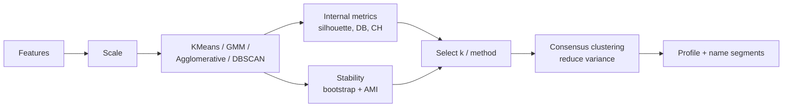
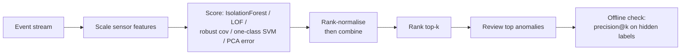
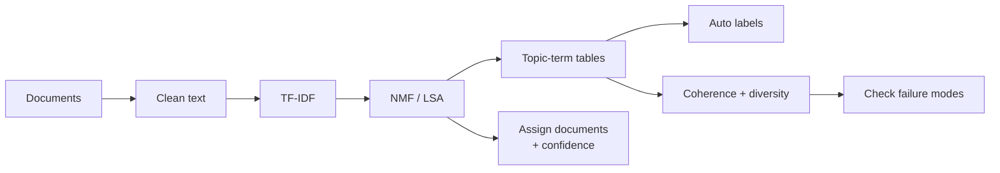
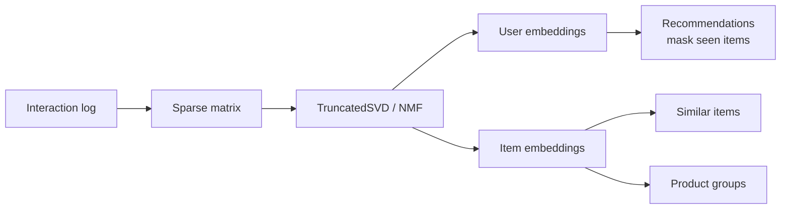
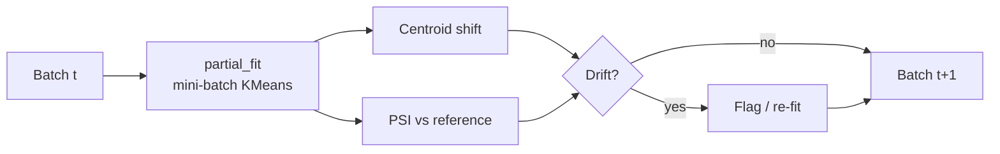
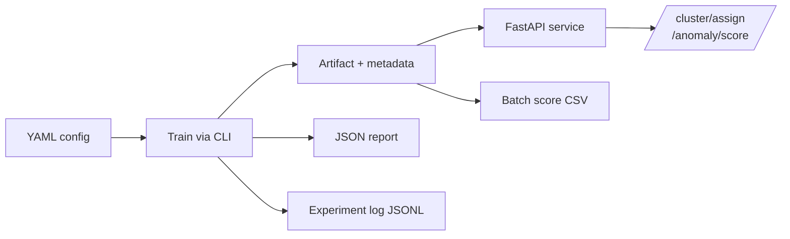

# Modelling Workflows

Diagrams of the workflows used across the project. They render natively on GitHub
(Mermaid). The first is the shared backbone; the rest specialise it per family.

## The shared unsupervised workflow

## Clustering and segmentation (notebooks 01, 06, 07)

## Anomaly detection (notebook 03)

## Topic modelling (notebook 04)

## Recommender embeddings (notebook 05)

## Streaming and drift (notebook 08)

## Production path (CLI / API)

